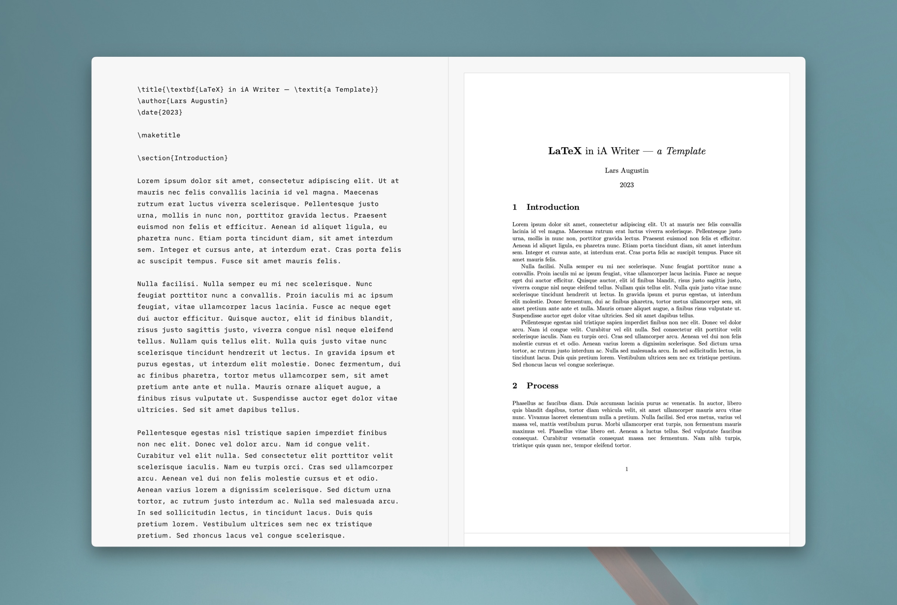

# LaTeX Template for iA Writer

With this template, you can preview & render `.tex` and `.latex` files in iA Writer. It was inspired by [iA’s Fountain Template](https://ia.net/topics/ia-writer-fountain-template), which also uses JavaScript to add support for a markup language to Writer.

The template uses [latex.js](https://latex.js.org/) for the LaTeX translation and thus comes with certain [limitations](https://latex.js.org/limitations.html). In addition, the hack-y nature of this implementation means workarounds are needed for adding images and other external content.

This template was built for personal use, but feel free to use,  clone and modify it!